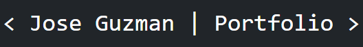
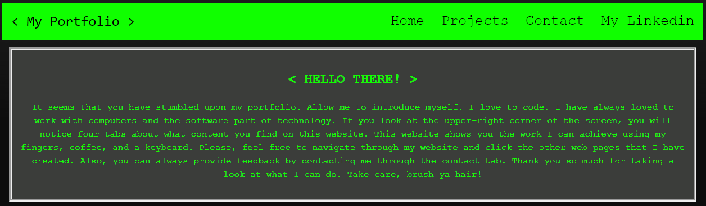

# Jose Guzman's Portfolio

## Description

Compact display of previous web pages created during and before Coding bootcamp Journey 

## Previews

## New and improved Portfolio

Below is my New and Improved Portfolio but with a few changes. Feel free to navigate through and scroll through the recent assignments and projects. 

## Old Portfolio

My Portfolio includes a nav bar were the visitor can navigate through the first webpage as well as go directly to my linked in. If said visitor would like to contact me they may by going to the "Contact" tab, which then redirect them to a form where they then submit some feedback or comments.

## Link to Application

* Here is the link : [JMGuzman-784/portfolio](https://github.com/JMGuzman-784/portfolio)
* Here is the pages: [JMGuzman-784/portfolio](https://jmguzman-784.github.io/portfolio/)